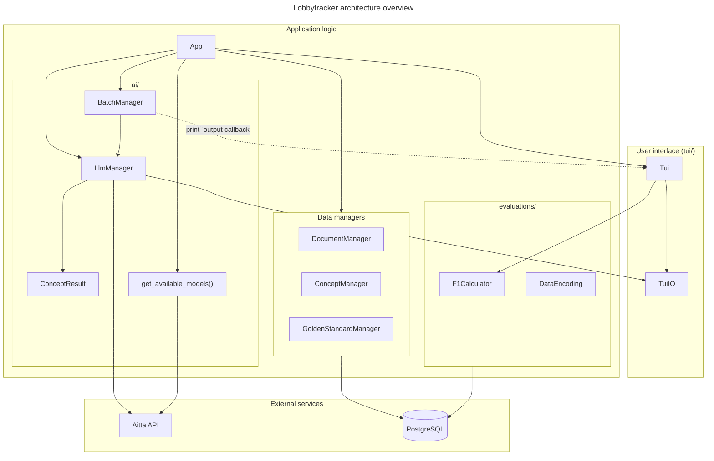

```mermaid
---
title: Lobbytracker architecture overview
---
flowchart TB
    subgraph UI["User interface (tui/)"]
        Tui
        TuiIO
    end

    subgraph Logic["Application logic"]
        App
        subgraph Managers["Data managers"]
            DocumentManager
            ConceptManager
            GoldenStandardManager
        end
        subgraph AI["ai/"]
            BatchManager
            LlmManager
            ConceptResult
            get_available_models["get_available_models()"]
        end
        subgraph Eval["evaluations/"]
            F1Calculator
            DataEncoding
        end
    end

    subgraph External["External services"]
        Aitta["Aitta API"]
        DB[("PostgreSQL")]
    end

    App --> Tui
    App --> Managers
    App --> BatchManager
    App --> LlmManager
    App --> get_available_models
    Tui --> TuiIO
    Tui --> F1Calculator
    BatchManager --> LlmManager
    Managers --> DB
    Eval --> DB
    BatchManager -.->|"print_output callback"| Tui
    LlmManager --> ConceptResult
    LlmManager --> TuiIO
    LlmManager --> Aitta
    get_available_models --> Aitta
```