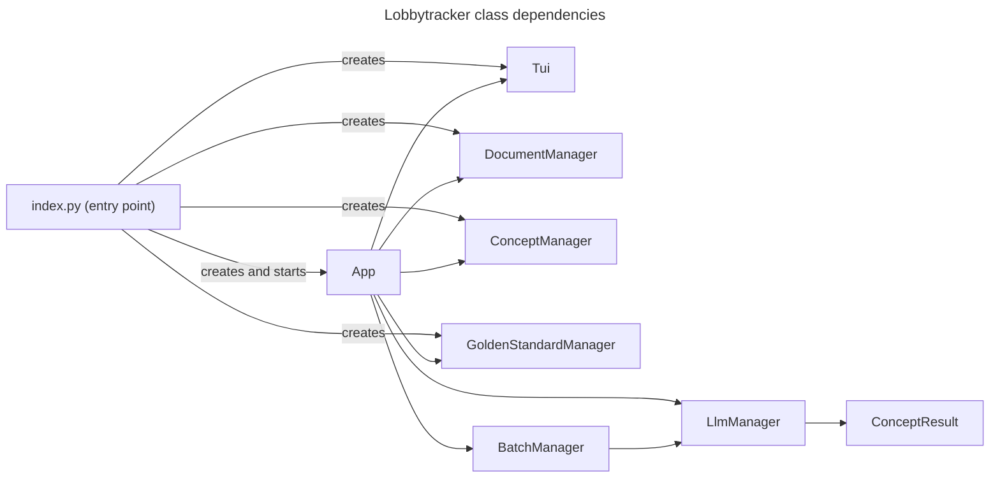

```mermaid
---
title: Lobbytracker class dependencies
---
flowchart LR
    index["index.py (entry point)"] -->|"creates and starts"| App
    index -->|creates| Tui
    index -->|creates| DocumentManager
    index -->|creates| ConceptManager
    index -->|creates| GoldenStandardManager

    App --> Tui
    App --> DocumentManager
    App --> ConceptManager
    App --> GoldenStandardManager
    App --> LlmManager
    App --> BatchManager

    BatchManager --> LlmManager
    LlmManager --> ConceptResult
```