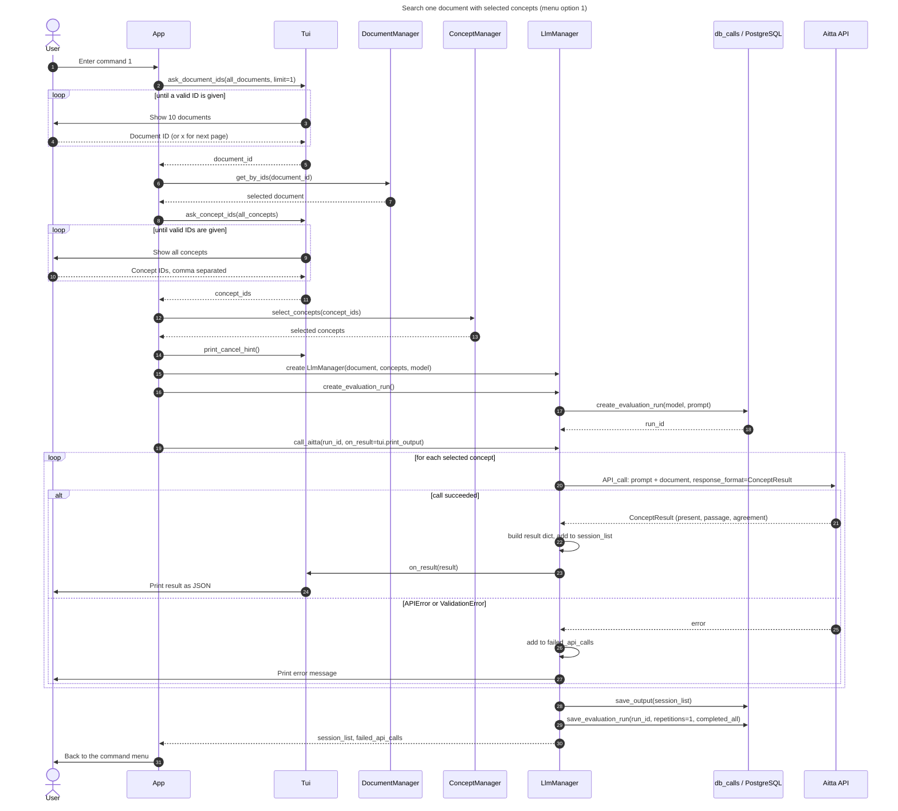

```mermaid
---
title: Search one document with selected concepts (menu option 1)
---
sequenceDiagram
    autonumber
    actor User
    participant App
    participant Tui
    participant Docs as DocumentManager
    participant Concepts as ConceptManager
    participant Llm as LlmManager
    participant DB as db_calls / PostgreSQL
    participant Aitta as Aitta API

    User->>App: Enter command 1
    App->>Tui: ask_document_ids(all_documents, limit=1)
    loop until a valid ID is given
        Tui->>User: Show 10 documents
        User-->>Tui: Document ID (or x for next page)
    end
    Tui-->>App: document_id
    App->>Docs: get_by_ids(document_id)
    Docs-->>App: selected document

    App->>Tui: ask_concept_ids(all_concepts)
    loop until valid IDs are given
        Tui->>User: Show all concepts
        User-->>Tui: Concept IDs, comma separated
    end
    Tui-->>App: concept_ids
    App->>Concepts: select_concepts(concept_ids)
    Concepts-->>App: selected concepts

    App->>Tui: print_cancel_hint()
    App->>Llm: create LlmManager(document, concepts, model)
    App->>Llm: create_evaluation_run()
    Llm->>DB: create_evaluation_run(model, prompt)
    DB-->>Llm: run_id

    App->>Llm: call_aitta(run_id, on_result=tui.print_output)
    loop for each selected concept
        Llm->>Aitta: API_call: prompt + document, response_format=ConceptResult
        alt call succeeded
            Aitta-->>Llm: ConceptResult (present, passage, agreement)
            Llm->>Llm: build result dict, add to session_list
            Llm->>Tui: on_result(result)
            Tui->>User: Print result as JSON
        else APIError or ValidationError
            Aitta-->>Llm: error
            Llm->>Llm: add to failed_api_calls
            Llm->>User: Print error message
        end
    end

    Llm->>DB: save_output(session_list)
    Llm->>DB: save_evaluation_run(run_id, repetitions=1, completed_all)
    Llm-->>App: session_list, failed_api_calls
    App->>User: Back to the command menu
```
