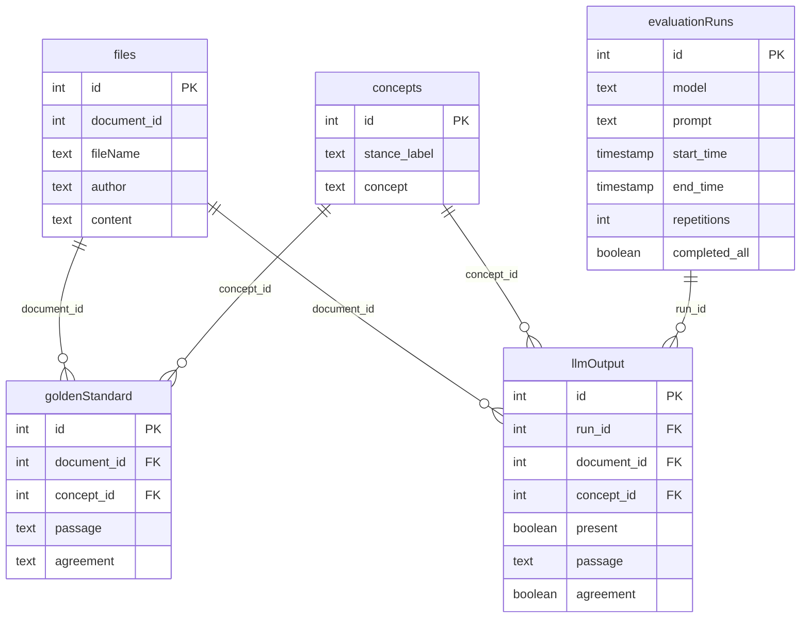

```mermaid
erDiagram
    files ||--o{ goldenStandard : "document_id"
    concepts ||--o{ goldenStandard : "concept_id"
    files ||--o{ llmOutput : "document_id"
    concepts ||--o{ llmOutput : "concept_id"
    evaluationRuns ||--o{ llmOutput : "run_id"

    files {
        int id PK
        int document_id
        text fileName
        text author
        text content
    }
    concepts {
        int id PK
        text stance_label
        text concept
    }
    goldenStandard {
        int id PK
        int document_id FK
        int concept_id FK
        text passage
        text agreement
    }
    evaluationRuns {
        int id PK
        text model
        text prompt
        timestamp start_time
        timestamp end_time
        int repetitions
        boolean completed_all
    }
    llmOutput {
        int id PK
        int run_id FK
        int document_id FK
        int concept_id FK
        boolean present
        text passage
        boolean agreement
    }
```